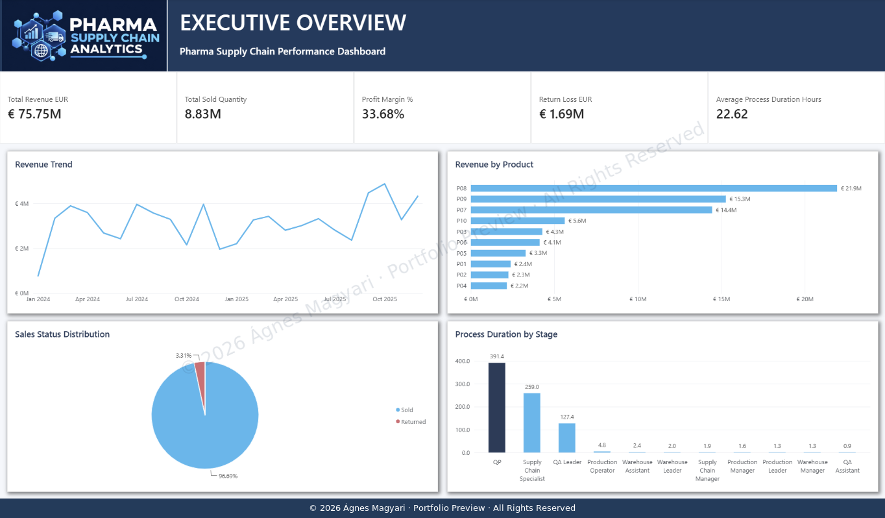
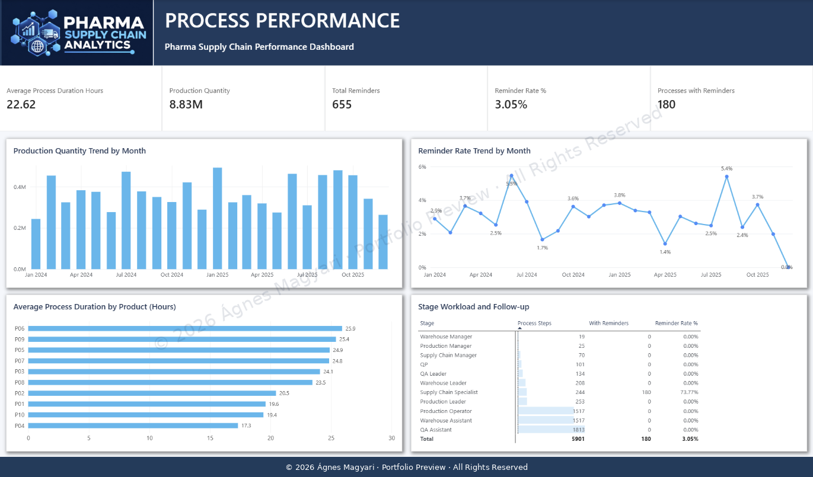
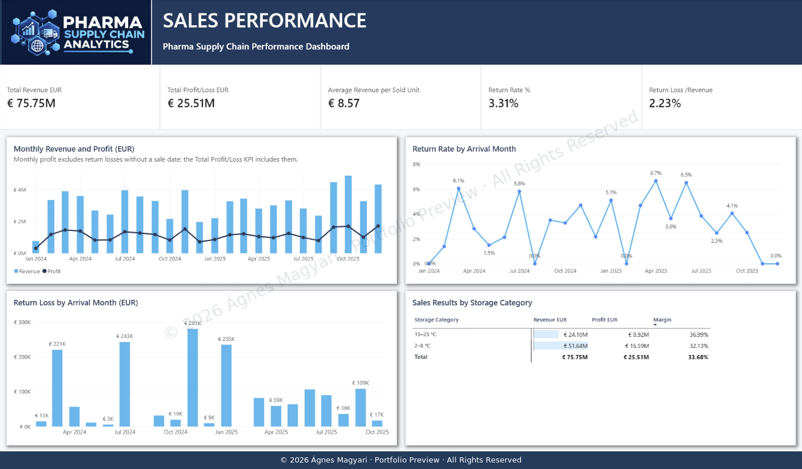
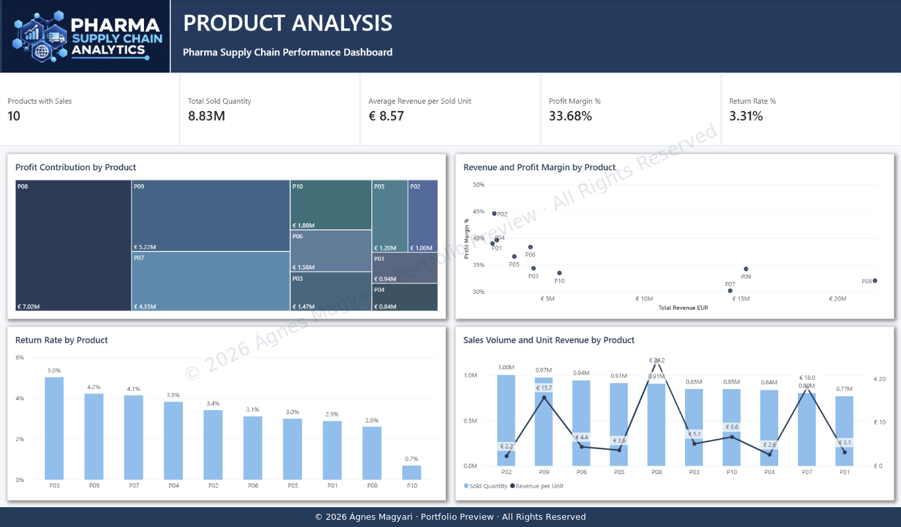
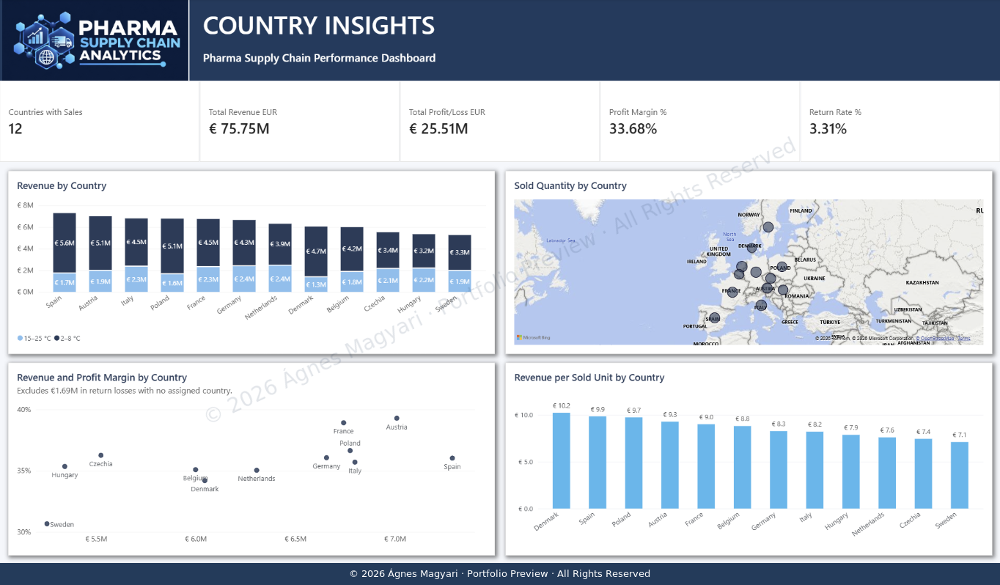

# Pharma Supply Chain Analytics

## Power BI Portfolio Project

A business intelligence portfolio project exploring pharmaceutical supply chain processes, sales performance, product profitability, and country-level results.

The report combines operational and financial analysis across five analytical pages and a cover page with navigation buttons. It helps users explore process workload, follow-up activity, revenue, profitability, and returns.

> **Portfolio preview:** This repository presents a curated overview of the project. The complete interactive Power BI report is available for presentation during an interview.

## Dashboard Previews

### Executive Overview

*An executive summary of revenue, sold quantity, profit margin, return losses, and average process duration, supported by revenue trends, product comparisons, sales status distribution, and stage-level process analysis.*

### Process Performance

*An operational view of production quantities, reminder rates, average process duration by product, and stage workload with follow-up activity.*

### Sales Performance

*A financial view of monthly revenue and profit, sales-record return rates by arrival month, return losses by arrival month, and sales results across storage categories.*

### Product Analysis

*A product-level comparison of profit contribution, revenue, profit margin, return rates, sales volume, and revenue per sold unit.*

### Country Insights

*A geographic view of revenue, sold quantity, profit margin, and revenue per sold unit, including revenue composition by storage category.*

---

## Project Overview

The report was designed to answer five key business questions:

- How do revenue, sales volume, profitability, and return losses compare across the dataset?
- Which process stages have the greatest workload and follow-up activity?
- How do sales results differ between storage categories?
- Which products contribute most to revenue and profit?
- How do sales performance and revenue per sold unit vary across countries?

The complete report contains six pages:

1. Cover — navigation to the five analytical pages.
2. Executive Overview
3. Process Performance
4. Sales Performance
5. Product Analysis
6. Country Insights

## Selected Results

| Indicator | Result |
| --- | ---: |
| Total Revenue | €75,745,215.00 |
| Total Profit/Loss | €25,509,336.03 |
| Profit Margin | 33.68% |
| Total Sold Quantity | 8,833,500 |
| Average Revenue per Sold Unit | €8.57 |
| Return Loss | €1,690,523.89 |
| Return Rate (sales records) | 3.31% |
| Average Process Duration | 22.62 hours |
| Products with Sales | 10 |
| Countries with Sales | 12 |

These results describe the synthetic dataset and do not represent an actual company's performance.

## Key Analytical Findings

- P08 generates the highest revenue and profit contribution, while P02 has the highest profit margin.
- Follow-up activity is concentrated in the Supply Chain Specialist stage: 180 of its 244 process records have reminders, representing 73.77%.
- Returned records account for 52 of 1,569 sales records, producing a record-based return rate of 3.31%.
- Return losses total approximately €1.69 million, equivalent to 2.23% of total revenue.
- Denmark has the highest revenue per sold unit (approximately €10.2), while Sweden has the lowest (approximately €7.1).

---

## Analytical Approach

The project applies:

- data cleaning and transformation with Power Query;
- dimensional data modelling;
- DAX measures and business indicators;
- date relationship management;
- time-based trend analysis;
- KPI and dashboard design;
- conditional formatting;
- interactive filtering and visual analysis;
- validation of data quality and filter context.

### Data Model

The model contains two fact tables:

- **FACT_ProcessTable:** process-stage records, including quantities, duration, and reminders.
- **FACT_SalesTable:** sales records, including status, quantity, financial results, and country information.

Dimension tables provide descriptive and filtering context for the analyses. Separate fact tables preserve the different levels of detail in process and sales records.

The country dimension supports geographic sales analysis. Date relationships support reporting by sale date and analysis by arrival date.

### Quantity Validation

Production quantity is calculated using records from the **Production Operator** stage.

Summing processed quantities across all stages would count quantities repeatedly and combine records with different operational meanings.

---

## Data Interpretation and Limitations

### Return Rate

The return rate is calculated from sales records:

**52 returned records / 1,569 sales records ≈ 3.31%.**

This measures the proportion of sales records marked as returned. It does not measure the proportion of units returned or revenue lost.

### Return Dates and Monthly Profit

Returned records have no sale date, but arrival dates are available. Return charts therefore group records by arrival month; they do not show the actual month in which a return occurred.

Arrival-date measures activate an inactive date relationship through DAX.

Monthly profit by sale date excludes return losses without a sale date. The **Total Profit/Loss** KPI includes those losses.

### Country-Level Profitability

All 52 returned records lack country information. Their approximately €1.69 million in losses cannot be assigned to individual countries.

Country-level profit and profit margin therefore exclude these losses, while the overall profit and margin KPIs include them.

No country-level return rate is calculated because the returned records cannot be attributed to countries. The **Return Rate** card on the Country Insights page shows the overall rate for the complete dataset in the displayed view.

### Process Duration

Average process duration describes recorded stage durations. It is not a measure of total supply chain lead time.

Stage averages should not be added together to infer total lead time.

---

## Tools and Technologies

- Microsoft Power BI
- Power Query
- DAX
- Dimensional Data Modelling
- Data Visualisation
- Business Intelligence

## Business Value

The report demonstrates how an analytical solution can help decision-makers:

- monitor operational and financial performance;
- identify stages with concentrated follow-up activity;
- compare product revenue and profitability;
- assess return losses;
- compare sales results by storage category and country;
- interpret KPIs with documented data limitations.

## Data Source

The project uses a synthetic dataset generated by the author with AI for a fictional pharmaceutical company.

The dataset was created for learning and portfolio demonstration. It does not represent a real company's operations or financial results.

The source dataset is not included in this public repository.

## About the Author

**Ágnes Magyari**

Business intelligence and data analytics professional with experience in clinical and pharmaceutical microbiology and an internal auditor qualification.

This project combines her pharmaceutical background, quality-oriented approach, and Power BI development skills to present operational and financial information through clear analytical reporting.

---

## Copyright and Usage

**© 2026 Ágnes Magyari. All Rights Reserved.**

This repository contains a portfolio presentation. The underlying dataset, Power BI source file (.pbix), complete data model, full DAX implementation, and detailed analytical documentation are not publicly distributed.

The author's original report design, analytical documentation, and portfolio presentation are provided for viewing and evaluation. No reuse licence is granted for these materials.

For permission to reproduce, modify, redistribute, publish, or reuse the author's original materials, please request prior written consent from Ágnes Magyari.

Third-party names, logos, map content, and other third-party materials remain subject to their respective owners' rights.
